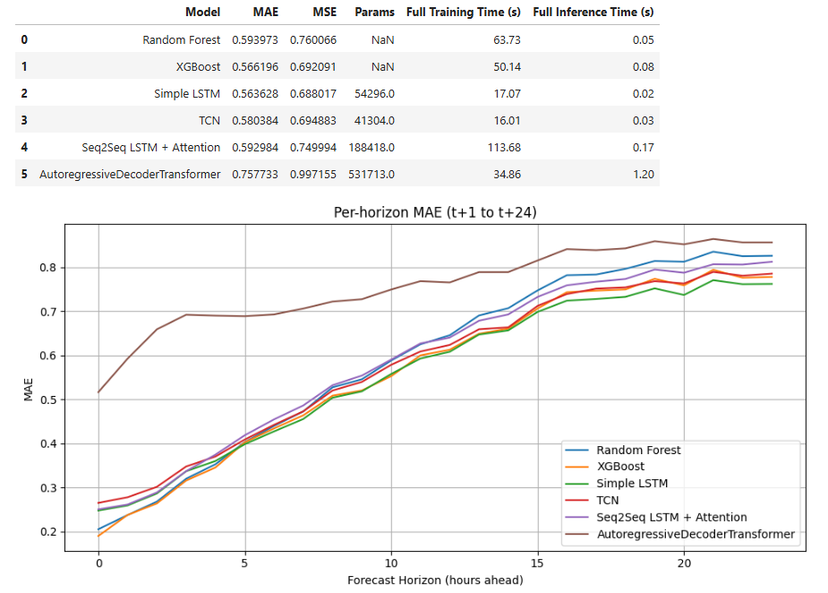
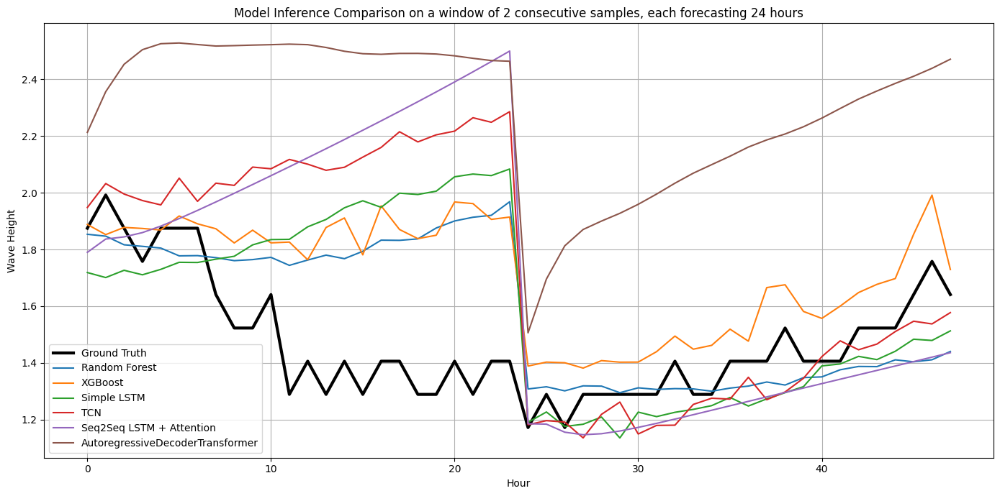

# Sea State Forecasting with Machine Learning & Deep Learning

This project develops and compares machine learning and deep learning models to predict the next 24 hours of wave height using the previous 24 hours of all features, based on nearly two decades of hourly data.

---

## Quick Overview

| Setting         | Details                                  |
|----------------|-------------------------------------------|
| Forecast Target | `WaveHeight` (next 24 hours)             |
| Input           | Last 24 hours of all features            |
| Data Range      | 2006-09-25 to 2025-03-28 (hourly)         |
| Missing Years   | 2008, 2009 (excluded due to gaps)        |
| Imputation      | Time-based linear interpolation           |
| Models Tested   | XGBoost, Random Forest, LSTM, TCN        |
| Validation      | 2022, 2023, 2024, 2025 years              |

---

## Running the models from the command line

The exploratory notebook has been distilled into an executable script
`train_seastate.py`. The script reproduces the univariate forecasting
pipeline (336 hours of context → 12 hour horizon) and trains the LSTM,
TCN and XGBoost baselines in a reproducible way.

```bash
python train_seastate.py \
  --dataset m6_buoy \
  --context 336 \
  --horizon 12 \
  --models lstm tcn xgboost \
  --output metrics.json
```

Important flags:

- `--data-path` – provide a local CSV/JSON dataset instead of
  downloading from the Marine Institute ERDDAP endpoint.
- `--features` – include additional predictor columns (the target column
  is always retained).
- `--max-windows` – cap the number of generated sliding windows for
  quick experiments.

The resulting metrics are printed to the console and, when `--output` is
specified, written to a JSON file.

---

## Modeling Approach

We frame the task as a multi-step direct forecast: given 24 hours of past data, predict 24 consecutive future wave height values.

### Context Window Strategy

- Overlapping context windows (stride <= window size) for the training data improve a little bit the performance.
- Larger context windows help LSTM and TCN, but have little impact on XGBoost and RF.

---

## Model Performance Summary



*Performance comparison of models (MAE across prediction horizons).*

- XGBoost performs best on short-term horizons (first 10 hours).
- LSTM and TCN outperform slightly in the longer term due to smoother forecasts.

---

## Output Examples

| Model      | Prediction Characteristics |
|------------|----------------------------|
| XGBoost    | Sharp, responsive, noisy   |
| LSTM/TCN   | Smoother, stable forecasts |



*Example predictions for different models. Ground truth in black.*

---

## Evaluation Strategy

- **Train/Test Split**: Training on 2006–2021, validation on 2022–2025
- **Metrics**: MAE per forecast horizon (1h to 24h), RMSE, visual plots
- **Frameworks**: PyTorch (LSTM, TCN), scikit-learn (RF), XGBoost

---

## References

- Bai, S., Kolter, J. Z., & Koltun, V. (2018). [An Empirical Evaluation of Generic Convolutional and Recurrent Networks for Sequence Modeling](https://arxiv.org/abs/1803.01271)

---

## Author

**Colin MININI**  
CentraleSupélec — MSc AI (Gap Year)  
Currently based in UCD, Ireland  
[colin.minini@student-cs.fr]
