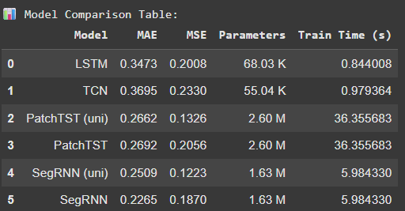
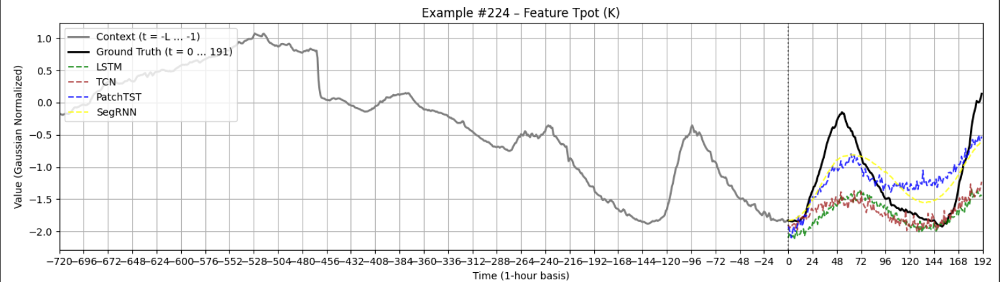
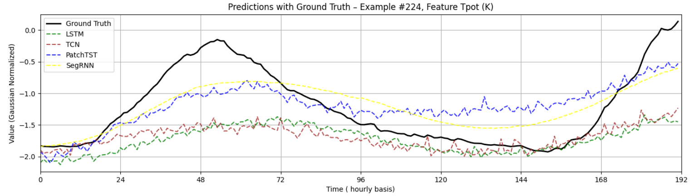
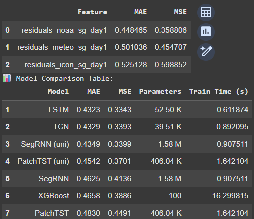

# 🌊 Sea State Forecasting with Deep Learning and Hybrid Residual Modeling
**Colin Minini — CentraleSupélec & University College Dublin**  
**February – July 2025 — HIGHWAVE Project**  

---

### 🧭 Overview
This research project explores **hybrid deep learning methods for forecasting ocean wave conditions** — in particular, the *significant wave height* (SWH) recorded by the **M6 buoy** off the west coast of Ireland.  
While physics-based numerical weather prediction (NWP) models provide reliable large-scale forecasts, they often exhibit **systematic local biases** and limited short-term accuracy.  
Here, we design deep neural networks that **learn the residuals between numerical forecasts and real observations**, effectively correcting physical model outputs through data-driven learning.

This work lies at the intersection of **scientific machine learning, time-series forecasting, and physical modeling** — bridging AI and oceanography in the context of the EU-funded **HIGHWAVE project**.

---

## 🚀 Goals & Contributions
- **Reimplement and benchmark** state-of-the-art long-term time-series architectures (LSTM, TCN, PatchTST, SegRNN) on benchmark and real datasets.  
- **Build a robust forecasting pipeline** handling missing data and contiguous sliding-window sampling for marine time series.  
- **Propose a hybrid residual-learning framework** combining numerical forecasts (NOAA, ICON, MFWAM etc.) with deep learning.  
- **Demonstrate accuracy gains** over both standalone deep learning and raw physical forecasts.  

---

## 🧩 Project Structure

├── data # Datasets created processed and used for the project

├── figures/ # All result plots (below)

├── notebooks # The experimenting notebooks

├── Sea_State_Forecast_Project_Report.pdf # Detailed technical report

├── Sea_State_Forecasting_with_Deep_Learning_and_Hybrid_Residual_Modeling # Main research notebook

No installation or setup is required — this repository consists of a **single, self-contained Jupyter notebook** reproducing all experiments and figures.

---

## 📊 Datasets
| Dataset | Source | Resolution | Purpose |
|----------|---------|-------------|----------|
| **weather.csv** | Public meteorological dataset | 10 min | Model benchmarking and architecture testing |
| **M6 Observational** | Irish Marine Data Buoy Network | 1 h | Real-world univariate SWH forecasting |
| **Hybrid (M6 + Forecasts)** | NOAA, ICON, MFWAM, StormGlass API merge | 1 h | Hybrid DL + Numerical residual learning |

---

## 🧠 Methodology
### 1. Forecasting Formulation
For each 24-hour horizon H, models use the past L = 336 hours of data to predict the next 24 hours:
\[
f_\theta(X_{t-L:t}) \approx Y_{t+1:t+H}
\]

In the **hybrid setup**, models learn residuals:
\[
r_\theta(R_t) \approx Y - \hat{Y}_{num}
\quad\Rightarrow\quad
\hat{Y} = \hat{Y}_{num} + r_\theta(R_t)
\]

### 2. Architectures Evaluated
- **LSTM** – Recurrent baseline for temporal dependencies  
- **TCN** – Causal dilated convolutions for sequence modeling  
- **PatchTST** – Transformer with patchwise attention for long-context forecasting [[Nie et al., 2023]](#references)  
- **SegRNN** – Segment Recurrent Neural Network optimized for long-term forecasting [[Lin et al., 2024]](#references)  
- **XGBoost** – Gradient-boosted tree baseline  

---

## 📈 Results

### 🔹 Benchmark (weather.csv)
Multivariate long-range forecasting reproduces published SOTA results.  
SegRNN and PatchTST show the lowest errors and best temporal consistency.

| Model | MAE | MSE | Parameters | Train Time (s) |
|:------|----:|----:|------------:|---------------:|
| LSTM | 0.347 | 0.200 | 68 K | 0.84 |
| TCN | 0.370 | 0.233 | 55 K | 0.97 |
| PatchTST (uni) | 0.266 | 0.133 | 2.6 M | 36.4 |
| PatchTST (multi) | 0.269 | 0.206 | 2.6 M | 36.4 |
| SegRNN (uni) | 0.251 | 0.122 | 1.6 M | 5.98 |
| SegRNN (multi) | **0.227** | **0.187** | 1.6 M | 5.98 |

---

### 🔹 Real-World M6 Forecasting
Univariate deep learning models predict 24-hour SWH evolution from past observations.  
SegRNN consistently provides the most stable and accurate forecasts.

*(Plots shown in the notebook and report.)*

---

### 🔹 Hybrid Residual Learning
Hybrid models learn to correct the bias of the best NWP forecasts (e.g., NOAA day1).

| Model | MAE | MSE | Parameters | Train Time (s) |
|:------|----:|----:|------------:|---------------:|
| LSTM | 0.432 | 0.334 | 52 K | 0.61 |
| TCN | 0.433 | 0.339 | 40 K | 0.89 |
| SegRNN (uni) | **0.434** | **0.339** | 1.6 M | 0.91 |
| PatchTST (uni) | 0.454 | 0.371 | 406 K | 1.64 |
| XGBoost | 0.466 | 0.389 | 100 | 16.3 |

Hybrid SegRNN improves upon the base NOAA forecast, demonstrating that **deep learning can act as a statistical correction layer** for physics-based ocean models.

---

## 💡 Key Insights
- **SegRNN** consistently achieved the best MAE/MSE trade-off across datasets.  
- **Residual learning** improved physical forecasts without discarding physical priors.  
- **Multivariate pretraining** enhanced univariate forecasting through shared-weight generalization.  
- Demonstrated a clear, interpretable gain of **AI-assisted physics modeling** in a real marine environment.  

---

## 🔭 Future Directions
- Extend residual learning to multiple buoys with **spatial models (Graph NNs)**.  
- Introduce **uncertainty quantification** (e.g., Bayesian DL, quantile regression).  
- Explore **self-supervised pretraining** on large-scale meteorological archives.  
- Apply the hybrid correction paradigm to **climate, energy, and atmospheric** forecasting domains.

---

## 🧾 References
- Lin S., Lin W., Wu W., Zhao F., Mo R., Zhang H. (2024). *Segment Recurrent Neural Network for Long-Term Time Series Forecasting.*  
- Nie Y., Nguyen N. H., Sinthong P., Kalagnanam J. (2023). *A Time Series is Worth 64 Words: Long-Term Forecasting with Transformers.*  
- Kong Y., Wang Z., Nie Y., Zhou T., Zohren S., Liang Y., Sun P., Wen Q. (2023). *Unlocking the Power of LSTM for Long-Term Time Series Forecasting.*  
- Wen Q., Zhou T., Zhang C., Chen W., Ma Z., Yan J., Sun L. (2023). *Transformers in Time Series: A Survey.*  
- Bai S., Kolter J. Z., Koltun V. (2018). *An Empirical Evaluation of Generic Convolutional and Recurrent Networks for Sequence Modeling.*

---

## 📬 Contact
For questions or collaborations: **colin.minini@student-cs.fr**